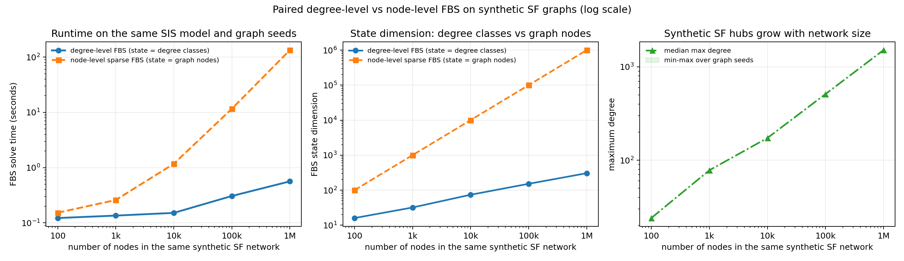

# Network Control and Differential Games: Foundations and Worked Examples

Foundation tutorial materials, runnable examples, and reference-code smoke tests for network optimal control, differential games, and hybrid or impulsive interventions. This is the first repository in a three-part tutorial family: it establishes the mathematical notation, shared Python package, basic experiments, and reference-code smoke tests used by the two companion notes.

This repository is public, but it does **not** grant a single blanket open-source license. Tutorial materials, generated examples, and third-party source snapshots have different copyright contexts. See [Repository License Notice](LICENSE), [Copyright and License Notes](COPYRIGHT_AND_LICENSE.md), and [Third-party Notices](THIRD_PARTY_NOTICES.md).

## Author Note

This tutorial was created from my research experience in optimal control, differential games, hybrid/impulsive control, and cyber/network-security applications over the past few years. The perspective is informed by publications in venues including IEEE TIFS, TDSC, TSMC, TNSE, TCSS, and related journals.

The repository is meant to be a tutorial bridge: start from the mathematical conditions, run small examples, and then inspect how similar ideas appear in paper-level research code.

If this is your first visit, start with [`START_HERE.md`](START_HERE.md).

## Repository Family

The public GitHub repository names are kept stable for links and installation commands. For course pages, slides, or citations, the recommended display names are:

| Order | Repository | Role |
| ---: | --- | --- |
| 0 | `network-control-differential-games` | **Foundation.** Mathematical setup, shared `cybercontrol` package, continuous/impulse/hybrid examples, degree-level versus node-level FBS scalability, and paper-level reference smoke runs. |
| 1 | [`note1-cyber-control-games`](https://github.com/LYang910920/note1-cyber-control-games) | **Companion Note 1.** Builds on the foundation package for PMP/FBSM baselines, sampled-data MDPs, DDQN, compact CTDE, node-SIPRS MAPPO, and cyber differential-game learning. |
| 2 | [`note2-pinn-pidl-cyber-control`](https://github.com/LYang910920/note2-pinn-pidl-cyber-control) | **Companion Note 2.** Builds on the same foundation package for inverse PINNs, PIDL, neural control, and PMP-informed residual learning. |

## Start Here

| Start with | Use it for |
| --- | --- |
| [`START_HERE.md`](START_HERE.md) | Five-minute orientation |
| [`docs/network_control_foundations.pdf`](docs/network_control_foundations.pdf) | Tutorial note and mathematical setup |
| [`docs/code_walkthrough_and_model_adaptation_guide.pdf`](docs/code_walkthrough_and_model_adaptation_guide.pdf) | How code maps to the math |
| [`docs/PARAMETERS.md`](docs/PARAMETERS.md) | Main model parameters, solver settings, baseline counts, and shared term definitions |
| [`docs/NOTATION_TO_CODE.md`](docs/NOTATION_TO_CODE.md) | Mathematical notation mapped to Python variables |
| [`docs/from_model_to_paper.md`](docs/from_model_to_paper.md) | Workflow from model formulation to paper experiments |
| [`examples/foundations/`](examples/foundations/) | Clean foundation examples |
| [`examples/reference/`](examples/reference/) | Paper-level reference smoke runs |
| [`examples/reference/MODEL_TAXONOMY.md`](examples/reference/MODEL_TAXONOMY.md) | Classifying the three reference repositories |
| [`docs/EXTENDING.md`](docs/EXTENDING.md) | How to adapt tutorial code to paper-level models |
| [`COPYRIGHT_AND_LICENSE.md`](COPYRIGHT_AND_LICENSE.md) | License and attribution boundaries |

## Code Entry Points

Most users only need the root runner. The deeper files are listed here so the code is easy to find without browsing the tree.

| Run or read | Path | Purpose |
| --- | --- | --- |
| Full repo check | [`run_all.py`](run_all.py) | Runs foundation examples and reference smoke tests from the repository root. |
| Foundation runner | [`examples/foundations/code/run_foundation_examples.py`](examples/foundations/code/run_foundation_examples.py) | Rebuilds foundation figures, CSV files, and generated result notes. |
| Minimal control example | [`examples/foundations/code/simple_degree_k_control.py`](examples/foundations/code/simple_degree_k_control.py) | Small degree-k continuous optimal-control example. |
| Companion models | [`examples/foundations/code/network_control_examples.py`](examples/foundations/code/network_control_examples.py) | Degree-level, node-level, game, and hybrid/impulse examples. |
| Scalability timing | [`examples/foundations/code/scalability_analysis.py`](examples/foundations/code/scalability_analysis.py) | Paired degree-level versus sparse node-level FBS on the same SIS epidemic-control problem and the same synthetic SF graph seeds. |
| Reference smoke runner | [`examples/reference/run_reference_smoke.py`](examples/reference/run_reference_smoke.py) | Paper-level smoke tests for the three reference repositories. |
| Shared node models | [`src/cybercontrol/network_models.py`](src/cybercontrol/network_models.py) | Canonical node-level SIPS/SIPRS equations, graph pressure, NumPy/Torch RHS parity, and stochastic transition helper. |
| Shared diagnostics | [`src/cybercontrol/diagnostics.py`](src/cybercontrol/diagnostics.py) | Common training-diagnostic glossary rows, rolling means, and figure-caption helpers used by the companion notes. |

Before changing a model, read [`docs/PARAMETERS.md`](docs/PARAMETERS.md). For paper-specific adaptations, read [`docs/EXTENDING.md`](docs/EXTENDING.md) after the first smoke run. It points to the code hooks for continuous control, impulse control, hybrid control, degree-level models, node-level models, and reference-repository smoke runs.

## Quick Run

From the repository root:

```bash
python3 -m venv .venv
source .venv/bin/activate
python -m pip install --upgrade pip
python -m pip install -e .
python run_all.py
```

`python-igraph` is used by the foundation scalability experiment and by the reference smoke runner. If it is hard to install in the active environment, you can still run the non-scalability foundation examples:

```bash
python run_all.py --skip-reference --skip-scalability
```

For reference-only smoke runs, you can also install `python-igraph` into the local reference dependency folder:

```bash
python -m pip install --target examples/reference/pydeps python-igraph
python run_all.py
```

Run only the foundation examples:

```bash
python run_all.py --skip-reference
```

Run only the reference smoke tests:

```bash
python run_all.py --skip-foundations
```

## Recommended Learning Path

1. Open [`START_HERE.md`](START_HERE.md) for the compact map.
2. Open [`docs/network_control_foundations.pdf`](docs/network_control_foundations.pdf) for the tutorial note and mathematical setup.
3. Run the foundation examples first with `python run_all.py --skip-reference`.
4. Read [`docs/code_walkthrough_and_model_adaptation_guide.pdf`](docs/code_walkthrough_and_model_adaptation_guide.pdf) while comparing it with [`examples/foundations/code/`](examples/foundations/code/).
5. Run the reference smoke tests with `python run_all.py --skip-foundations`.
6. Use [`examples/reference/MODEL_TAXONOMY.md`](examples/reference/MODEL_TAXONOMY.md) first, then [`examples/reference/reference_repository_guide.md`](examples/reference/reference_repository_guide.md), to map the paper-level code back to the simplified examples.

## Output Preview

Only representative previews are shown here. The detailed per-model figures, CSV files, and run notes live under `examples/foundations/results/` and `examples/reference/results/`.

**Tutorial examples: continuous, game, node-level, and hybrid models**


This contact sheet is a compact visual index for the tutorial examples: degree-level control/game, node-level control/game, convergence diagnostics, and one hybrid control example. Time-axis plots show state/control evolution; iteration-axis plots show FBS convergence.

**Scalability: paired degree-level vs node-level FBS on the same epidemic model**



This plot compares degree-level and sparse node-level FBS at `100`, `1,000`, `10,000`, `100,000`, and `1,000,000` nodes. For each network size, both rows use the same synthetic scale-free graph seed and the same normalized SIS epidemic-control problem. The degree-level state is one entry per observed degree class; the node-level state is one entry per graph node. In the checked-in million-node run, degree-level FBS has `305` degree-class states and takes about `0.563s`; node-level FBS has `1,000,000` node-indexed states and takes about `133.781s`; all runs converged. The third panel checks that the synthetic SF maximum degree grows visibly from `24` to `1513`.

To regenerate the paired comparison, run:

```bash
python run_all.py --skip-reference
```

The optional `--include-node-scalability` flag still runs a separate sparse node-only stress test. It is useful for implementation checks with a different node-only parameter profile, but it is not the degree-vs-node comparison figure.

**Reference smoke runs: paper-level code checks for TIFS/TCSS repositories**


These smoke runs use small local sample data to check the three reference repositories without redistributing full paper datasets. They are grouped separately from the foundation examples because they are paper-level code snapshots with their own upstream licenses.

After a fresh run, new outputs are written to timestamped or rerun folders:

| Command | Output location |
| --- | --- |
| `python run_all.py --skip-reference` | `examples/foundations/results/rerun_YYYYMMDD_HHMMSS/` |
| `python run_all.py --skip-foundations` | `examples/reference/results/reference_repos_rerun/` |
| `python run_all.py` | both locations above |

The foundation runner writes a generated `README.md`, `parameter_summary.csv`, `fbs_convergence.png`, model-specific baseline comparison figures, and the paired degree/node FBS scalability plot. The reference runner writes `smoke_run_report.md`, `parameter_summary.csv`, `reference_convergence.png`, and one baseline comparison figure per reference model. In these notes, iteration-axis plots inspect convergence of an algorithmic update loop, time-axis plots show state evolution or computed control/game strategies, and network-size plots show runtime scaling. Continuous controls are time-indexed curves sampled on the simulation grid, impulse controls act only at discrete event times and are drawn as vertical lines, and hybrid control combines both. State labels specify whether the curve is a node mean, a population-weighted degree-class mean, or a selected degree class.

## Core Layout

```text
.
├── README.md
├── pyproject.toml
├── requirements.txt
├── run_all.py
├── src/cybercontrol/
├── docs/
│   ├── network_control_foundations.pdf
│   ├── code_walkthrough_and_model_adaptation_guide.pdf
│   ├── NOTATION_TO_CODE.md
│   └── from_model_to_paper.md
└── examples/
    ├── foundations/
    │   ├── code/        # foundation Python code and runner
    │   └── results/
    └── reference/
        ├── MODEL_TAXONOMY.md
        ├── reference_repositories/
        └── results/
```

## What Is Included

For a code-first map of the examples, see [`examples/README.md`](examples/README.md).

### Foundation examples

The foundation examples are self-contained and should be the first code you run.

- `simple_degree_k_control.py`: a compact degree-k SIS optimal-control example.
- `network_control_examples.py`: degree-level games, node-level control/game models, and a hybrid impulse simulation.
- `scalability_analysis.py`: paired degree-level and sparse node-level FBS timing on the same SIS epidemic-control problem and graph seeds from 100 to 1000000 nodes.
- `sample_data/`: a small edge list and adjacency matrix.
- `results/`: precomputed figures and degree-distribution CSV files.

Go deeper in [examples/foundations/README.md](examples/foundations/README.md).

### Reference source snapshots

The reference folder includes source-code snapshots from three upstream research repositories. These repositories correspond to my co-authored cyber/network-control publications: two papers in IEEE TIFS and one paper in IEEE TCSS.

| Repository | Class |
| --- | --- |
| `OpinionMalware_TIFS_2025_Code` | Node-level malware-opinion optimal impulse control |
| `PropagandaWar_TIFS_2024_Code` | Degree-level hybrid/impulsive differential game |
| `Propaganda_TCSS_2025_Code` | Node-level awareness-aware optimal impulse control |

Each snapshot keeps its upstream `README` and `LICENSE`. Full paper datasets are not included. The smoke runner uses small local sample data so the workflows can run without redistributing external datasets.

Go deeper in [examples/reference/README.md](examples/reference/README.md) and [examples/reference/MODEL_TAXONOMY.md](examples/reference/MODEL_TAXONOMY.md).

## Related Tutorial Repositories

| Repository | Use it for |
| --- | --- |
| [note1-cyber-control-games](https://github.com/LYang910920/note1-cyber-control-games) | Continue from the foundation examples to game learning, PMP/FBSM baselines, ODE-RL, DDQN, compact CTDE, and node-SIPRS MAPPO cyber-control examples. |
| [note2-pinn-pidl-cyber-control](https://github.com/LYang910920/note2-pinn-pidl-cyber-control) | Continue from the same foundation package to PINN/PIDL, inverse learning, neural control, and PMP-informed neural cyber-control examples. |

## Model Adaptation Checklist

When adapting the examples to a new model, work in this order:

1. Choose the modeling level: degree-level, node-level, or hybrid/impulse.
2. Replace the state equation `f(x, u)`.
3. Update the Jacobian `f_x`.
4. Update the objective or payoff.
5. Re-derive the Hamiltonian control update from `f_u`.
6. Check state and control constraints.
7. Run short-horizon tests first.
8. Add no-control, constant-control, random-control, or unilateral-deviation baselines.
9. Run a small scalability check before increasing the node-level state dimension.

For differential games, the computed controls are open-loop Nash candidates satisfying necessary conditions. Treat them as numerical candidates until unilateral-deviation checks support the interpretation.

## Shared Package

This repository is also the shared implementation source for the related tutorial repositories. The reusable package is `cybercontrol` under `src/`.

```bash
python -m pip install -e .
python -m pytest
python scripts/check_latex_style_sync.py
```

Note 1 and Note 2 can use the local package from a sibling workspace with:

```bash
python -m pip install -e ../network-control-differential-games
```

For graph-scale extensions, import SIPS/SIPRS dynamics from `cybercontrol.network_models`.  States are shaped `[nodes, compartments]`; `A[i,j]` means node `j` influences node `i`; patching moves `S -> P`; cleaning and natural recovery move `I -> R`; waning moves `P/R -> S`.

## Troubleshooting

If a run fails with `ModuleNotFoundError`, install the root requirements in the Python environment you are actually using:

```bash
python -m pip install -r requirements.txt
python -c "import igraph, networkx, scipy, pandas, matplotlib; print('core dependencies ok')"
```

If `python-igraph` is the only difficult package and you only need the reference smoke runner, use the local install path:

```bash
python -m pip install --target examples/reference/pydeps python-igraph
python run_all.py --skip-foundations
```

## Public-repository Notes

- No project-wide open-source license is granted by default; see [`LICENSE`](LICENSE).
- Tutorial PDFs and LaTeX sources are included as tutorial materials; confirm redistribution rights before reusing them elsewhere.
- Third-party source snapshots retain their upstream licenses and citations.
- Full paper datasets are not vendored.
- Generated figures and CSV files are included for quick inspection and reproducibility checks.
