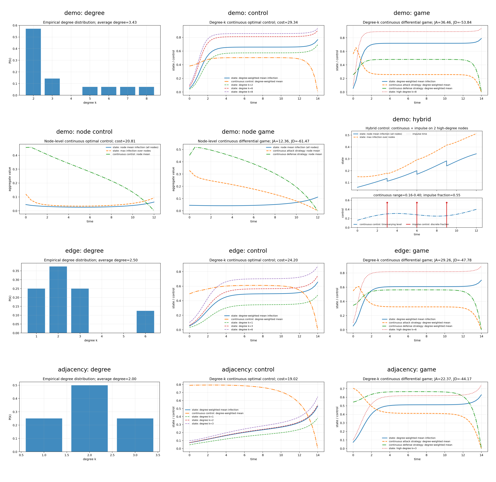
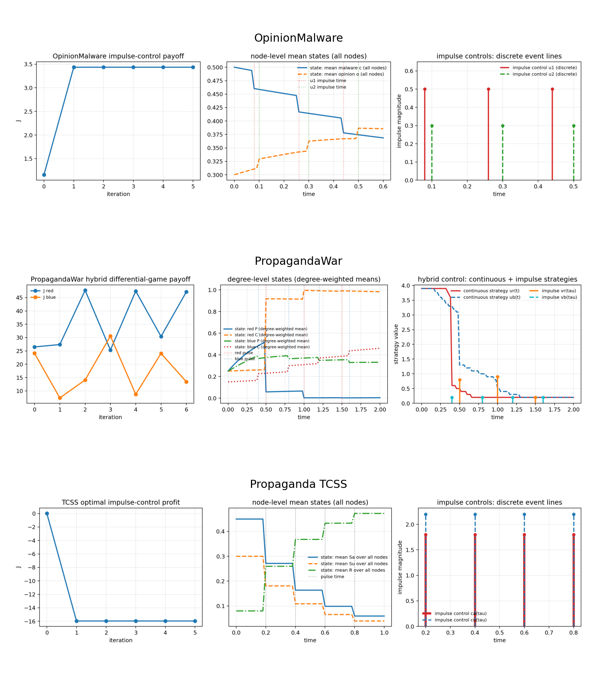

# Network Optimal Control and Differential Games

Teaching notes, runnable examples, and reference-code smoke tests for network optimal control, differential games, and hybrid or impulsive interventions.

This repository is public, but it does **not** grant a single blanket open-source license. Tutorial materials, generated examples, and third-party source snapshots have different copyright contexts. See [Repository License Notice](LICENSE), [Copyright and License Notes](COPYRIGHT_AND_LICENSE.md), and [Third-party Notices](THIRD_PARTY_NOTICES.md).

## Author Note

This tutorial was created from my research experience in optimal control, differential games, hybrid/impulsive control, and cyber/network-security applications over the past few years. The perspective is informed by publications in venues including IEEE TIFS, TDSC, TSMC, TNSE, TCSS, and related journals.

The repository is meant to be an educational bridge: start from the mathematical conditions, run small teaching examples, and then inspect how similar ideas appear in paper-level research code.

## Start Here

| Start with | Use it for |
| --- | --- |
| [`docs/lecture_note.pdf`](docs/lecture_note.pdf) | Mathematical setup |
| [`docs/code_walkthrough_and_model_adaptation_guide.pdf`](docs/code_walkthrough_and_model_adaptation_guide.pdf) | How code maps to the math |
| [`examples/lecture/`](examples/lecture/) | Clean teaching examples |
| [`examples/reference/`](examples/reference/) | Paper-level reference smoke runs |
| [`examples/reference/MODEL_TAXONOMY.md`](examples/reference/MODEL_TAXONOMY.md) | Classifying the three reference repositories |
| [`COPYRIGHT_AND_LICENSE.md`](COPYRIGHT_AND_LICENSE.md) | License and attribution boundaries |

## Quick Run

From the repository root:

```bash
python3 -m venv .venv
source .venv/bin/activate
python -m pip install --upgrade pip
python -m pip install -r requirements.txt
python run_all.py
```

If `python-igraph` is hard to install in the active environment, install it locally for the reference runner:

```bash
python -m pip install --target examples/reference/pydeps python-igraph
python run_all.py
```

Run only the lecture examples:

```bash
python run_all.py --skip-reference
```

Run only the reference smoke tests:

```bash
python run_all.py --skip-lecture
```

## Recommended Learning Path

1. Open [`docs/lecture_note.pdf`](docs/lecture_note.pdf) for the mathematical setup.
2. Run the lecture examples first with `python run_all.py --skip-reference`.
3. Read [`docs/code_walkthrough_and_model_adaptation_guide.pdf`](docs/code_walkthrough_and_model_adaptation_guide.pdf) while comparing it with [`examples/lecture/code/`](examples/lecture/code/).
4. Run the reference smoke tests with `python run_all.py --skip-lecture`.
5. Use [`examples/reference/MODEL_TAXONOMY.md`](examples/reference/MODEL_TAXONOMY.md) first, then [`examples/reference/reference_repository_guide.md`](examples/reference/reference_repository_guide.md), to map the paper-level code back to the simplified examples.

## Output Preview

Lecture examples:



Reference-repository smoke runs:



After a fresh run, new outputs are written to timestamped or rerun folders:

| Command | Output location |
| --- | --- |
| `python run_all.py --skip-reference` | `examples/lecture/results/rerun_YYYYMMDD_HHMMSS/` |
| `python run_all.py --skip-lecture` | `examples/reference/results/reference_repos_rerun/` |
| `python run_all.py` | both locations above |

The lecture runner writes `figure_explanations.md` in each lecture output folder. The reference runner writes `smoke_run_report.md` in each reference output folder. In these notes, iteration-axis plots inspect convergence of an algorithmic update loop, while time-axis plots show state evolution or computed control/game strategies. Continuous controls are time-indexed curves sampled on the simulation grid, impulse controls act only at discrete event times and are drawn as vertical lines, and hybrid control combines both. State labels specify whether the curve is a node mean, a degree-weighted mean, or a selected degree class.

## Core Layout

```text
.
├── README.md
├── requirements.txt
├── run_all.py
├── docs/
│   ├── lecture_note.pdf
│   └── code_walkthrough_and_model_adaptation_guide.pdf
└── examples/
    ├── lecture/
    │   ├── code/
    │   └── results/
    └── reference/
        ├── MODEL_TAXONOMY.md
        ├── reference_repositories/
        └── results/
```

## What Is Included

For a code-first map of the examples, see [`examples/README.md`](examples/README.md).

### Lecture examples

The lecture examples are self-contained and should be the first code you run.

- `simple_degree_k_control.py`: a compact degree-k SIS optimal-control example.
- `network_control_examples.py`: degree-level games, node-level control/game models, and a hybrid impulse simulation.
- `sample_data/`: a small edge list and adjacency matrix.
- `results/`: precomputed figures and degree-distribution CSV files.

Go deeper in [examples/lecture/README.md](examples/lecture/README.md).

### Reference source snapshots

The reference folder includes source-code snapshots from three upstream research repositories. These repositories correspond to my co-authored cyber/network-control publications: two papers in IEEE TIFS and one paper in IEEE TCSS.

| Repository | Class |
| --- | --- |
| `OpinionMalware_TIFS_2025_Code` | Node-level malware-opinion optimal impulse control |
| `PropagandaWar_TIFS_2024_Code` | Degree-level hybrid/impulsive differential game |
| `Propaganda_TCSS_2025_Code` | Node-level awareness-aware optimal impulse control |

Each snapshot keeps its upstream `README` and `LICENSE`. Full paper datasets are not included. The smoke runner uses small local sample data so the workflows can run without redistributing external datasets.

Go deeper in [examples/reference/README.md](examples/reference/README.md) and [examples/reference/MODEL_TAXONOMY.md](examples/reference/MODEL_TAXONOMY.md).

## Model Adaptation Checklist

When adapting the examples to a new model, work in this order:

1. Choose the modeling level: degree-level, node-level, or hybrid/impulse.
2. Replace the state equation `f(x, u)`.
3. Update the Jacobian `f_x`.
4. Update the objective or payoff.
5. Re-derive the Hamiltonian control update from `f_u`.
6. Check state and control constraints.
7. Run short-horizon tests first.
8. Add no-control, constant-control, random-control, or unilateral-deviation baselines.

For differential games, the computed controls are open-loop Nash candidates satisfying necessary conditions. Treat them as numerical candidates until unilateral-deviation checks support the interpretation.

## Troubleshooting

If a run fails with `ModuleNotFoundError`, install the root requirements in the Python environment you are actually using:

```bash
python -m pip install -r requirements.txt
python -c "import networkx, scipy, pandas, matplotlib; print('core dependencies ok')"
```

If `python-igraph` is the only difficult package, use the local install path:

```bash
python -m pip install --target examples/reference/pydeps python-igraph
python run_all.py --skip-lecture
```

## Public-repository Notes

- No project-wide open-source license is granted by default; see [`LICENSE`](LICENSE).
- Tutorial PDFs and LaTeX sources are included as educational materials; confirm redistribution rights before reusing them elsewhere.
- Third-party source snapshots retain their upstream licenses and citations.
- Full paper datasets are intentionally not vendored.
- Generated figures and CSV files are included for quick inspection and reproducibility checks.
