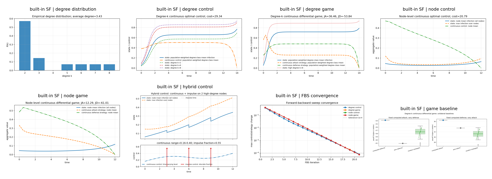
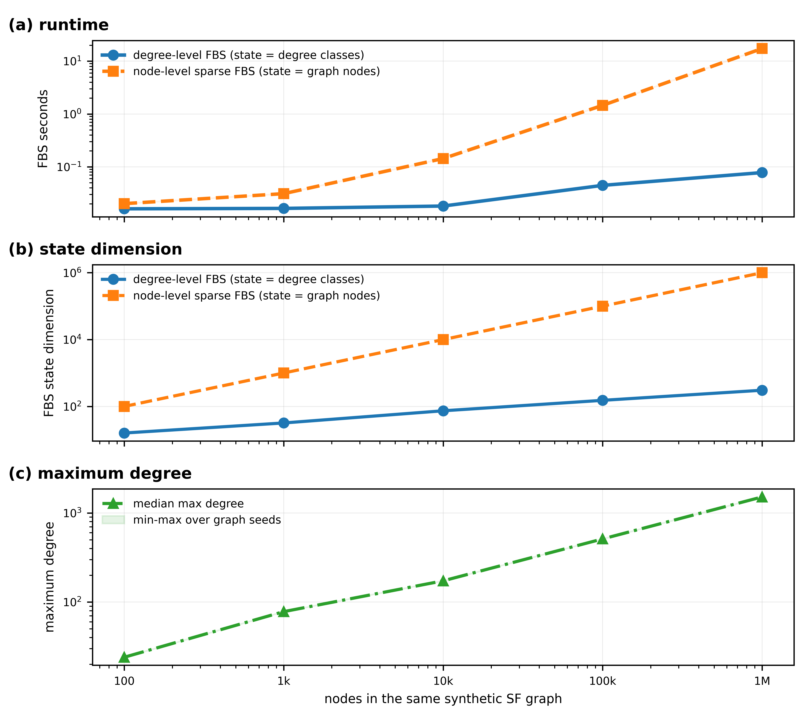
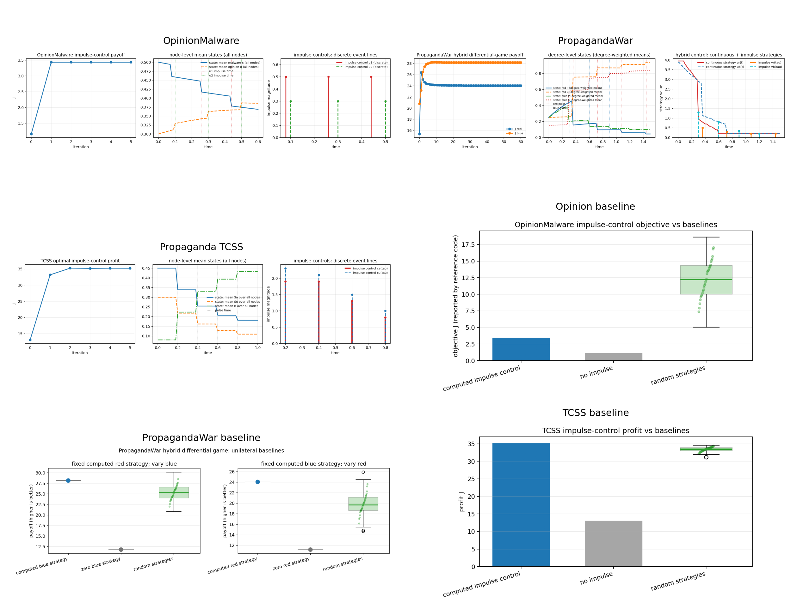

# Network Control and Differential Games

Foundation tutorial materials, shared Python package, runnable examples, and reference-code smoke tests for network optimal control, differential games, impulse interventions, and continuous-impulsive interventions. The repository introduces the notation, canonical `cybercontrol` package, and small reproducible checks used by the two companion repositories.

This public repository does **not** grant a single blanket open-source license. Tutorial materials, generated examples, and third-party source snapshots have different copyright contexts. See `LICENSE`, `COPYRIGHT_AND_LICENSE.md`, and `THIRD_PARTY_NOTICES.md`.

## Author Note

This tutorial was created from my research experience in optimal control, differential games, impulse control, continuous-impulsive hybrid control, and cyber/network-security applications over the past few years. The perspective is informed by publications in venues including IEEE TIFS, TDSC, TSMC, TNSE, TCSS, and related journals.

## Repository Family

| Order | Repository | Role |
|---:|---|---|
| 0 | `network-control-differential-games` | Foundation notation, shared `cybercontrol` package, heterogeneous degree/node equations, continuous-time, impulse, and continuous-impulsive examples, scalability, and reference smoke runs. |
| 1 | [note1-cyber-control-games](https://github.com/LYang910920/note1-cyber-control-games) | FBSM baselines, sampled-data MDP conversion, DDQN defense, compact CTDE, cooperative node-SIPS MAPPO, and larger node-SIPS attacker-defender benchmarks. |
| 2 | [note2-pinn-pidl-cyber-control](https://github.com/LYang910920/note2-pinn-pidl-cyber-control) | PINN/PIDL inverse learning, neural control, PMP-informed losses, and graph-state residual examples. |

## 5-Minute Quick Start

```bash
python -m venv .venv
source .venv/bin/activate
python -m pip install --upgrade pip
python -m pip install -e ".[graph,dev]"
python run_all.py --skip-reference --skip-scalability
python -m pytest -q
```

Run the fuller foundation examples and reference smoke tests:

```bash
python run_all.py --skip-reference
python run_all.py --skip-foundations
```

`python-igraph` is optional. If it is difficult to install locally, use the non-scalability examples:

```bash
python -m pip install -e ".[dev]"
python run_all.py --skip-reference --skip-scalability
```

## Code Map

| Need | Start here |
|---|---|
| Tutorial PDF | `docs/network_control_foundations.pdf` |
| Code walkthrough PDF | `docs/code_walkthrough_and_model_adaptation_guide.pdf` |
| Parameters and solver settings | `docs/PARAMETERS.md` |
| Notation mapped to Python variables | `docs/NOTATION_TO_CODE.md` |
| Paper workflow and extensions | `docs/from_model_to_paper.md`, `docs/EXTENDING.md` |
| Shared package | `src/cybercontrol/` |
| Heterogeneous degree/node parameters | `src/cybercontrol/heterogeneity.py`, `src/cybercontrol/network_models.py` |
| Foundation example runner | `examples/foundations/code/run_foundation_examples.py` |
| Minimal degree-level control example | `examples/foundations/code/simple_degree_k_control.py` (homogeneous scalar profile) |
| Main continuous/game/continuous-impulse examples | `examples/foundations/code/network_control_examples.py` (canonical heterogeneous runs) |
| Degree-vs-node scalability | `examples/foundations/code/scalability_analysis.py` |
| Reference repository smoke runs | `examples/reference/run_reference_smoke.py` |
| Reference model taxonomy | `examples/reference/MODEL_TAXONOMY.md`, `examples/reference/reference_repository_guide.md` |

## Capability Status

| Capability | API / file | Command | Metrics | Validation status |
|---|---|---|---|---|
| Heterogeneous degree-level optimal control | `cybercontrol.heterogeneity`, `network_control_examples.py::solve_degree_control` | `python run_all.py --skip-reference --skip-scalability` | cost, FBS convergence, matched-mean cost, random-control baselines | per-class susceptibility, infectivity, recovery, weights, costs, bounds |
| Heterogeneous degree-level attacker-defender game | `solve_degree_game` | same command | attacker/defender payoff, unilateral baseline matrix | per-class rewards, losses, costs, bounds, assortative mixing |
| Heterogeneous node-level optimal control | `solve_node_control` | same command | cost, node-mean state/control, matched-mean cost | per-node rates, weights, costs, bounds |
| Heterogeneous node-level attacker-defender game | `solve_node_game` | same command | attacker/defender payoff, unilateral baseline matrix | per-node rewards, losses, costs, bounds |

The simple degree-k file remains a short homogeneous example. The advanced foundation script uses the shared heterogeneous equations and writes `heterogeneous_vs_matched_mean.csv`.

## Representative Experiments

The foundation examples compare heterogeneous degree-level control/game models, heterogeneous node-level variants, matched-mean homogeneous baselines, convergence diagnostics, and continuous-impulse behavior.



The scalability check uses the same synthetic scale-free graph seeds for degree-level and sparse node-level FBS on the same SIS epidemic-control problem.



The reference smoke runs execute lightweight checks for the paper-level repositories while preserving third-party snapshots and license boundaries.



## Extension Route

1. Read `docs/PARAMETERS.md` before changing model horizons, rates, graph sizes, impulse settings, or FBS tolerances.
2. Use `src/cybercontrol/` for shared numerics, heterogeneous parameter profiles, graph equations, Torch helpers, plotting, metrics, and output utilities.
3. Keep new paper-specific code in examples or companion repositories unless at least two real callers need a shared helper.
4. Store rerun CSVs, temporary figures, and medium-run diagnostics under ignored `artifacts/`.
5. Preserve third-party reference snapshots and their license files.

## Validation

```bash
python -m compileall -q src examples tests
python -m pytest -q
python run_all.py --skip-reference --skip-scalability
```

Extended local scalability check:

```bash
python examples/foundations/code/scalability_analysis.py \
  --model-level compare \
  --sizes 100,1000,10000,100000,1000000 \
  --steps 12 --iterations 35 --tolerance 1e-3 --repeats 1 \
  --output-dir artifacts/extended_validation/scalability_degree_node_100_to_1m
```

This bounded million-node run converged for every paired degree/node case. At 1,000,000 nodes, the degree-level FBS state had 305 degree classes and solved in about 0.08 seconds; the sparse node-level FBS state had 1,000,000 nodes and solved in about 17.4 seconds.

LaTeX sources live in `docs/source/`; current PDFs live in `docs/`. Build PDFs from the source directory and copy only the final PDF back to `docs/`.

## Citation and License

Use `CITATION.md` for citation guidance. Review `LICENSE`, `COPYRIGHT_AND_LICENSE.md`, and `THIRD_PARTY_NOTICES.md` before redistribution or reuse.
